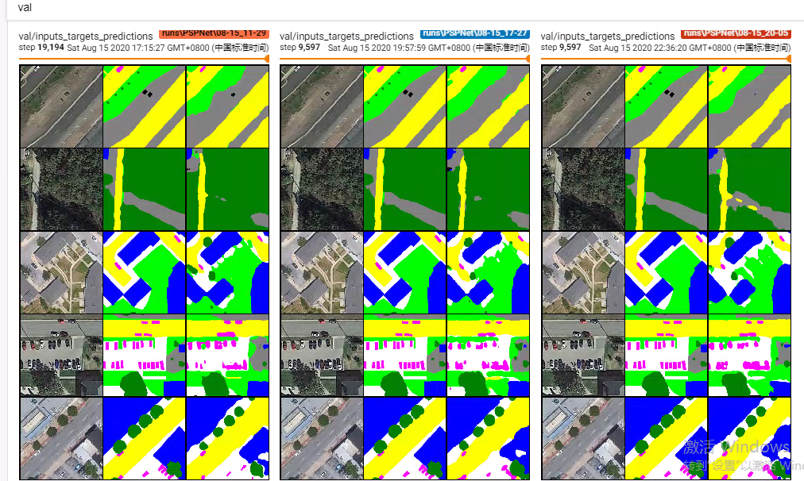

# gf2-gf3

## 项目介绍

高分遥感图像解译大赛项目,已复现多种图片语义分割模型

## 运行说明

模型

- (Deeplab V3+) Encoder-Decoder with Atrous Separable Convolution for Semantic Image Segmentation [Paper]

- (GCN) Large Kernel Matter, Improve Semantic Segmentation by Global Convolutional Network [Paper]

- (UperNet) Unified Perceptual Parsing for Scene Understanding [Paper]

- (DUC, HDC) Understanding Convolution for Semantic Segmentation [Paper]

- (PSPNet) Pyramid Scene Parsing Network [Paper]

- (ENet) A Deep Neural Network Architecture for Real-Time Semantic Segmentation [Paper]

- (U-Net) Convolutional Networks for Biomedical Image Segmentation (2015): [Paper]

- (SegNet) A Deep ConvolutionalEncoder-Decoder Architecture for ImageSegmentation (2016): [Paper]

- (FCN) Fully Convolutional Networks for Semantic Segmentation (2015): [Paper]


损失函数

- Cross-Entorpy loss：交叉熵损失函数

- Dice-Loss:两个样本之间重叠的测度，更能反映训练目标(最大化mIoU)，但高度非凸性，难以优化。


- CE Dice loss：损失的骰子和CE的总和，CE给出了平滑的优化，而损失的骰子是一个很好的指标分割结果的质量。

- Focal Loss,：CE的另一个版本，用于避免阶级不平衡，自信的预测被缩小。

数据集文件

```shell
$ ----sat\
$     |----train\
$     |    |----img\
$     |    |    |----1.tif
$     |    |    |----1.xml
$     |    |    |----1_gt.png
$     |    |----lbl\
$     |    |    |----1_gt.png
$     |----valid\
$     |    |----img\
$     |    |    |----421.tif
$     |    |    |----421.xml
$     |    |    |----421_gt.png
$     |    |----lbl\
$     |    |    |----421_gt.png

```
训练

```
python train.py --config config.json
```


查看训练指标

```
tensorboard --logdir saved
```


inference

```
python inference.py input_path output_path
```
## 结果

实例分割


